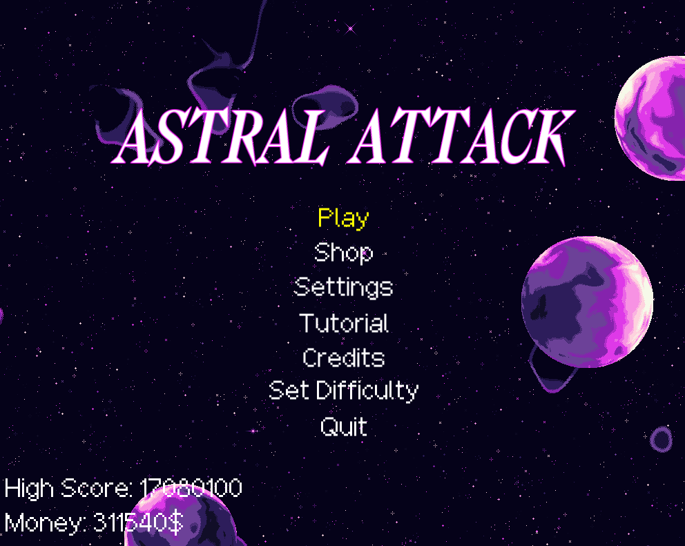
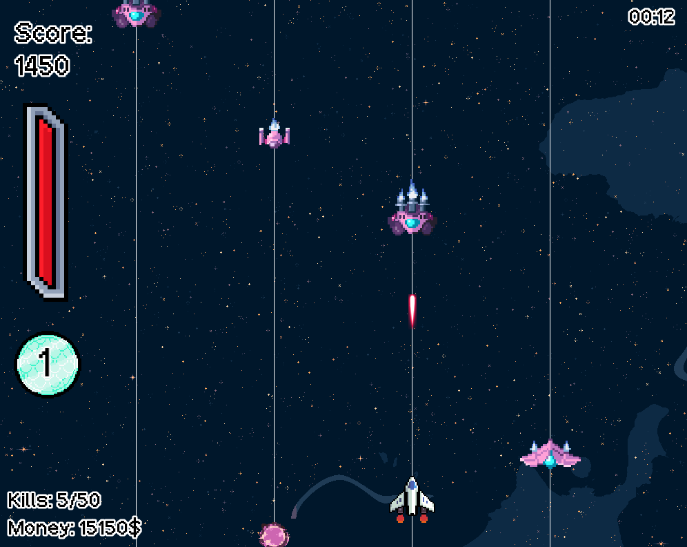
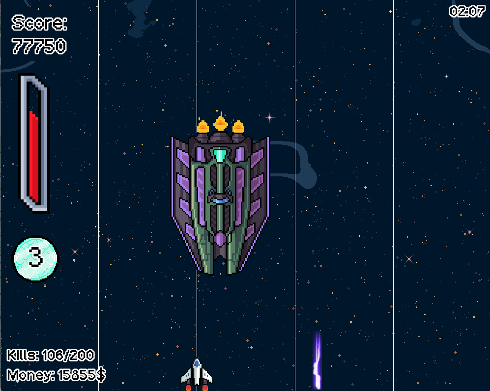
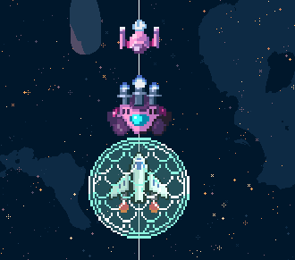
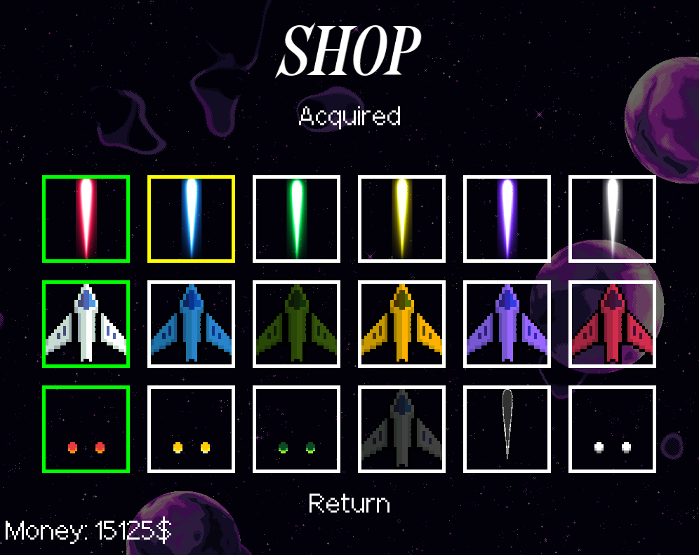

# Astral Attack

Astral Attack is a space shooter made in C++ with SFML.

Move between four lanes, destroy enemy ships, collect power-ups, and fight the boss at the end of each stage.

## Gameplay

- Destroy enemies to earn score and money.
- Collect power-ups to heal and become stronger.
- Build up kills to gain shields.
- Use shields to become temporarily invulnerable.
- Complete stages and defeat bosses.
- Choose between three difficulty settings.

## Shop

Spend money earned during a run on new ships, bullets, and engine fire effects.

## Controls

- **Left / Right:** Change lanes
- **Up / Down:** Move within a lane
- **Z:** Shoot
- **X:** Use a shield
- **P:** Pause
- **Escape:** Return or quit
- **Enter:** Select a menu option

## Running the game

Download the Windows release, extract the full ZIP file, and launch the game.

## Built with

- C++
- SFML
- Visual Studio

## License

The original game code is available under the [MIT License](LICENSE). Third-party assets and libraries use their own licenses; see [Third-Party Licenses](THIRD_PARTY_LICENSES.md).

## Asset credits

### Sprites

- [Stage 1 Boss — Void Fleet Pack 2 by Foozle](https://foozlecc.itch.io/void-fleet-pack-2) — CC0
- [Stage 2 Boss and Enemies — Void Fleet Pack 1 by Foozle](https://foozlecc.itch.io/void-fleet-pack-1) — CC0
- [Stage 3 Boss and Enemies — Void Fleet Pack 3 by Foozle](https://foozlecc.itch.io/void-fleet-pack-3) — CC0
- [Player Spaceship and Shield — Void Main Ship by Foozle](https://foozlecc.itch.io/void-main-ship) — CC0
- [Health Bar — Basic Pixel Health Bar by BDragon1727](https://bdragon1727.itch.io/basic-pixel-health-bar-and-scroll-bar) — Free for non-commercial games
- [Lasers — Laser 2020 by Wenrexa](https://wenrexa.itch.io/laser2020) — CC0
- [Background — Space Background Generator by Deep-Fold](https://deep-fold.itch.io/space-background-generator) — MIT License
- [End Screen Planet — Pixel Planet Generator by Deep-Fold](https://deep-fold.itch.io/pixel-planet-generator) — MIT License
- [Asteroid — Void Environment Pack by Foozle](https://foozlecc.itch.io/void-environment-pack) — CC0
- [Buff Sprites — Celestial Objects by Useless Pursuit](https://uselesspursuit.itch.io/celestial-objects-pixel-art-pack) — Free for commercial and non-commercial projects
- [Stage 1 Enemies — Spaceship Shooter Environment by Ansimuz](https://ansimuz.itch.io/spaceship-shooter-environment) — CC0

### Fonts

- [Mephisto](https://fontesk.com/mephisto-font/) — Free for commercial use
- [Pixelbasel](https://fontesk.com/pixelbasel-font/) — SIL Open Font License

### Music

- [Space Shooter Music](https://opengameart.org/content/space-shooter-music) — CC BY 3.0 — MUSIC BY OBLIDIVM — [Oblidivm Music](http://oblidivmmusic.blogspot.com.es/)
- [Unchained Destiny (Rock)](https://opengameart.org/content/unchained-destiny-rock) — CC0

### Sound effects

- [Menu Button — Apenguin73](https://freesound.org/people/Apenguin73/sounds/428132/) — CC0
- [Enemy Hit — LeMudCrab](https://freesound.org/people/LeMudCrab/sounds/163456/) — CC0
- [Player Hit — qubodup](https://freesound.org/people/qubodup/sounds/182429/) — CC0
- [Player Laser — Daleonfire](https://freesound.org/people/Daleonfire/sounds/505235/) — CC0
- [Pause — Wagna](https://freesound.org/people/Wagna/sounds/326418/) — CC0
- [Heal — colorsCrimsonTears](https://freesound.org/people/colorsCrimsonTears/sounds/562292/) — CC0
- [Power Up — MATRIXXX_](https://freesound.org/people/MATRIXXX_/sounds/523654/) — CC0
- [Lane Switch — lesaucisson](https://freesound.org/people/lesaucisson/sounds/585256/) — CC0
- [Boss Hit — Anthousai](https://freesound.org/people/Anthousai/sounds/405665/) — CC0
- [Boss Defeat Explosion — V-ktor](https://freesound.org/people/V-ktor/sounds/482993/) — CC0
- [Heavy Player Hit — qubodup](https://freesound.org/people/qubodup/sounds/442769/) — CC0
- [Laser Beam — magnuswaker](https://freesound.org/people/magnuswaker/sounds/588242/) — CC0
- [Boss Laser](https://pixabay.com/sound-effects/laser-zap-90575/) — Pixabay Content License
- [Shield — Joao_Janz](https://freesound.org/people/Joao_Janz/sounds/478342/) — CC0
- [Kill Counter Max — GameAudio](https://freesound.org/people/GameAudio/sounds/220173/) — CC0
- [Buy — wobesound](https://freesound.org/people/wobesound/sounds/488377/) — CC0
- [Insufficient Money — Raclure](https://freesound.org/people/Raclure/sounds/483598/) — CC0
- [Equip — GameWithBepis](https://freesound.org/people/GameWithBepis/sounds/561471/) — CC0
- [Set Difficulty](https://pixabay.com/sound-effects/menu-button-89141/) — Pixabay Content License
- [Second Boss Warning — StavSounds](https://freesound.org/people/StavSounds/sounds/701702/) — CC0
